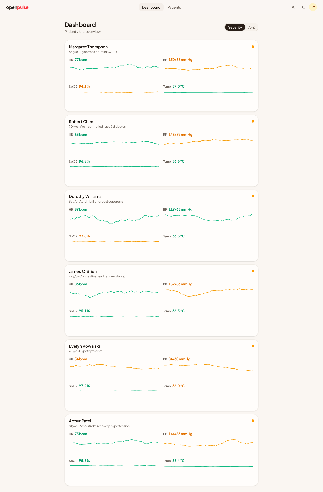
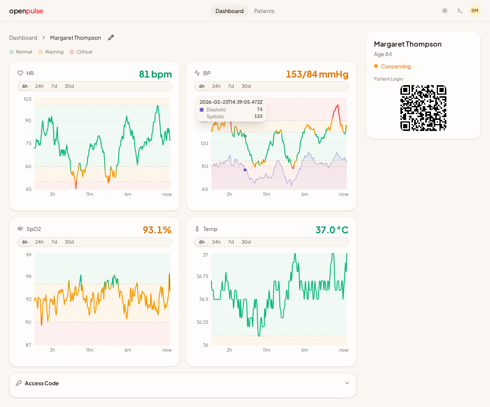
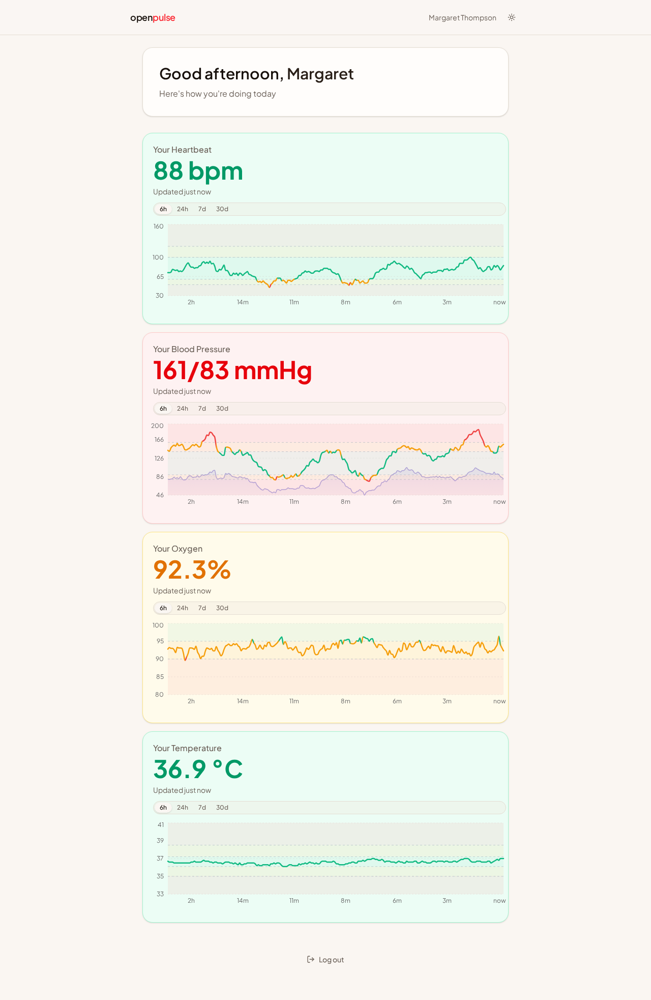
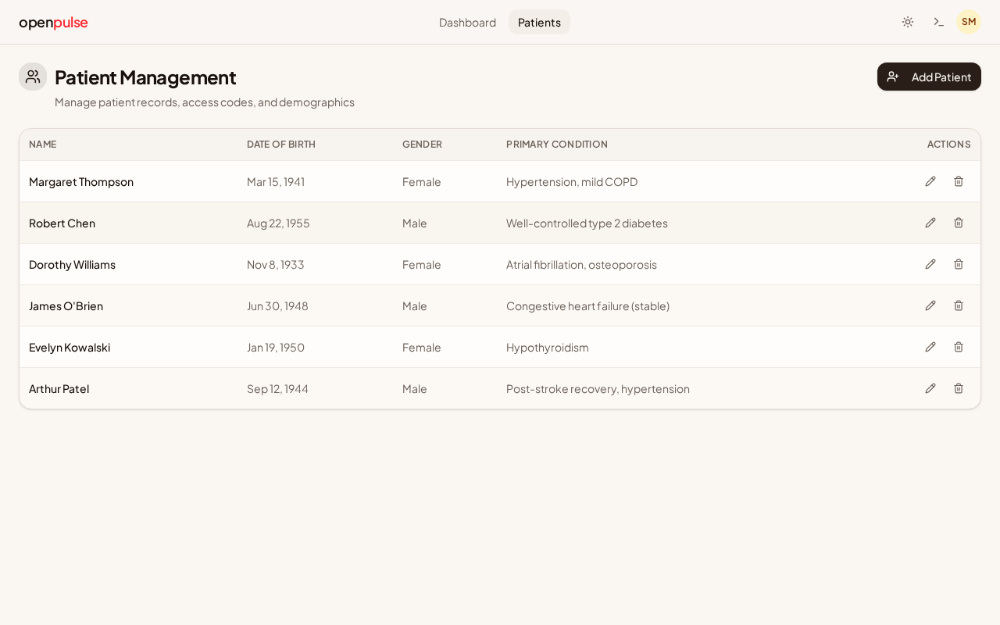
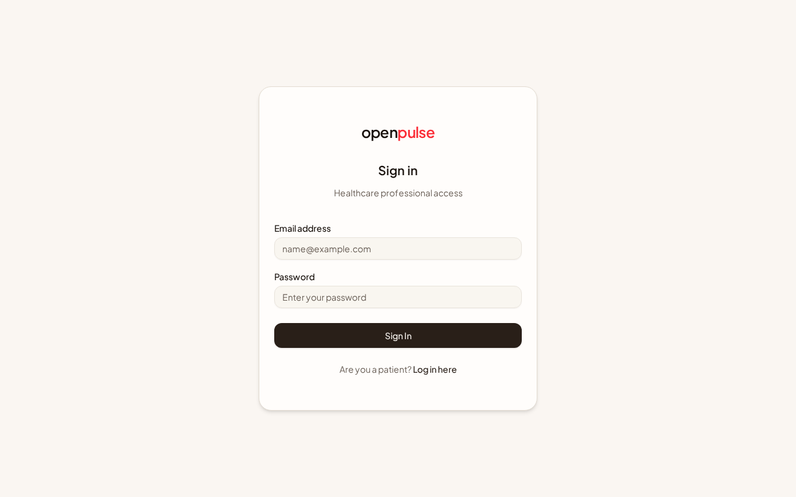
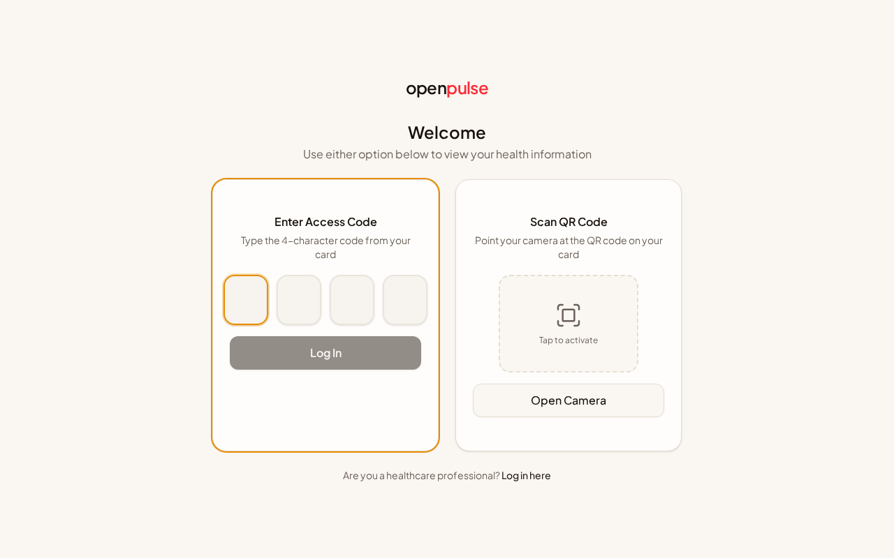

# OpenPulse

A real-time remote patient health monitoring platform built as an honours project (BSc Computing). OpenPulse provides healthcare professionals with a clinical dashboard for overseeing multiple patients simultaneously, and gives elderly patients a simplified, accessible portal to view their own vital signs.

## Overview

OpenPulse addresses the gap between expensive proprietary monitoring systems and underdeveloped open-source alternatives. The platform continuously monitors four vital signs — heart rate, blood pressure (systolic/diastolic), oxygen saturation (SpO2), and body temperature — streaming readings in real time with sub-second latency via WebSocket connections.

The system is built around two distinct user interfaces designed for fundamentally different user groups:

- **Healthcare Professional Dashboard** — A clinical interface with multi-patient overview, colour-coded threshold indicators (normal/concerning/critical), severity-based sorting, interactive trend charts with configurable time ranges, and patient management tools.
- **Patient Portal** — An elderly-first interface with large text, high contrast, simplified navigation, and minimal cognitive load. Patients authenticate via a 4-character access code or QR scan rather than traditional email/password.

## Screenshots

### Healthcare Professional Dashboard
Multi-patient overview with real-time vital signs, sparkline trends, severity sorting, and colour-coded clinical thresholds.



### Patient Detail View
Individual patient monitoring with interactive charts for each vital sign, configurable time ranges (6h/24h/7d/30d), threshold reference lines, and a QR code for patient self-access.



### Patient Portal
Elderly-first accessible interface with large text, high-contrast colours, simplified navigation, and per-vital trend charts. Greets the patient by name with a time-appropriate message.



### Patient Management
CRUD interface for managing patient records, access codes, and demographics.



### Authentication
Dual login system — email/password for healthcare professionals (left), 4-character access code or QR scan for patients (right).

<p float="left">
  
  
</p>

## Architecture

OpenPulse is a pnpm monorepo with three packages:

```
client/          React 19 frontend (Vite 7 + TanStack Router)
server/          Express 5 API + Socket.io + simulator engine
shared/          Shared TypeScript type definitions
```

### Tech Stack

| Layer | Technologies |
|-------|-------------|
| Frontend | React 19, Vite 7, TypeScript 5.9, TanStack Router v1, TanStack Query v5, Tailwind CSS v4, shadcn/ui, Recharts v3, Socket.io Client v4 |
| Backend | Express 5, Node.js, Socket.io v4, Drizzle ORM v0.45, better-sqlite3, bcryptjs, jsonwebtoken |
| Database | SQLite with WAL mode, foreign key constraints enabled |
| Monorepo | pnpm workspaces with shared type package |

### Data Flow

The architecture splits communication into two channels:

1. **REST API** (Express) — Handles CRUD operations, authentication, and historical data queries. Works with TanStack Query's caching and prefetching model.
2. **WebSocket** (Socket.io) — Handles live vital sign streaming only. Socket.io acts as a cache update signal rather than a separate data store — incoming readings are written directly into TanStack Query's cache via a socket bridge hook.

```
Simulator Engine
    │
    ├── onReading callback ──→ SQLite (persistence)
    │                     ──→ Batch Emitter (buffer)
    │
    └── Batch Emitter (1s flush, latest-per-patient dedup)
            │
            └── Socket.io room emit ──→ patient:{id} room
                                            │
                                    Client useVitalsStream hook
                                            │
                                    TanStack Query cache update
                                            │
                                    React re-render (charts, cards)
```

The batch emitter flushes every second with latest-per-patient deduplication, preventing event floods while maintaining near-real-time delivery.

### Room-Based Access Control

Socket.io rooms enforce data isolation at the transport layer. Healthcare professionals join all active patient rooms on connection. Patients join only their own room (`patient:{id}`). This means access control is handled at the socket level — no application-level filtering needed per event.

## Vital Signs Simulator

### Why a Simulator Instead of a Static Dataset

The original approach was to replay readings from a Kaggle vital signs dataset. This was abandoned for several reasons:

1. **The dataset was deleted from Kaggle**, making it unavailable for reproducible research or demonstration.
2. **Static replay cannot exercise real-time features** — replaying pre-recorded CSV rows at fixed intervals produces flat, predictable data that doesn't meaningfully test threshold alerts, anomaly detection, or trend visualisation.
3. **No scenario injection** — a static dataset contains whatever it contains. There's no way to trigger a fever spike or desaturation event on demand to demonstrate the system's clinical alerting.
4. **Per-patient clinical profiles are impossible** — real patients have different baselines (an 85-year-old with COPD has fundamentally different normal SpO2 than a healthy 71-year-old). A single dataset applies the same distribution to everyone.

The dynamic simulator solves all of these problems while producing data that is statistically and physiologically more realistic than dataset replay.

### How the Simulator Works

The simulator engine generates vital signs using a **discrete Ornstein-Uhlenbeck (OU) stochastic process** — a mean-reverting random walk commonly used in quantitative finance and physiological modelling:

```
x_{n+1} = x_n + θ(μ - x_n)Δt + σ√(Δt) · N(0,1)
```

Where:
- `μ` is the patient's baseline mean (e.g., heart rate of 78 bpm for a hypertensive 85-year-old)
- `θ` controls reversion speed (how quickly vitals return to baseline after perturbation)
- `σ` controls volatility (how much random variation occurs between readings)
- `N(0,1)` is standard normal noise

This produces readings that drift naturally around a baseline — wandering away and then reverting back — which closely mimics real physiological behaviour. Each vital type has tuned OU parameters (e.g., SpO2 uses a higher theta of 0.20 for faster reversion since oxygen saturation is tightly regulated by the body, while temperature uses 0.10 for slower drift).

### Patient Profiles

Six patients are seeded with clinically distinct profiles, each with unique baseline means and standard deviations per vital:

| Patient | Age | Condition | Key Baseline Differences |
|---------|-----|-----------|-------------------------|
| Margaret Thompson | 85 | Hypertension + mild COPD | Higher systolic BP (148), lower SpO2 (93%) |
| Robert Chen | 71 | Type 2 diabetes (well-controlled) | Near-normal baselines |
| Dorothy Williams | 92 | Atrial fibrillation | Irregular heart rate patterns |
| James O'Brien | 78 | Congestive heart failure (stable) | Elevated resting HR, lower SpO2 |
| Evelyn Kowalski | 76 | Hypothyroidism | Lower baseline temperature |
| Arthur Patel | 81 | Post-stroke + hypertension | Elevated BP baselines |

Healthcare professionals can add and remove patients through the management interface. New patients receive auto-generated baselines.

### Cross-Vital Correlations

Vitals don't vary independently in reality — if heart rate increases, blood pressure tends to follow. The simulator applies physiological correlation adjustments after generating each vital independently:

- Heart rate → systolic BP (coefficient 0.3) and diastolic BP (0.2)
- SpO2 drop → compensatory heart rate increase (coefficient -0.4)
- Temperature rise → heart rate increase (coefficient 0.25)

### Clinical Scenarios

Pre-defined clinical scenarios can be triggered to demonstrate the system's alerting and visualisation capabilities:

- **Bradycardia** — Heart rate drops 20 bpm below baseline over 3 minutes
- **Fever Spike** — Temperature rises 1.5°C with compensatory heart rate increase over 5 minutes
- **Desaturation** — SpO2 drops 6% with slow recovery and HR compensation over 4 minutes
- **Hypertensive Crisis** — Systolic BP rises 40 mmHg over 4 minutes

Scenarios work by modifying the OU parameters (shifting the target mean, adjusting volatility) rather than injecting hardcoded values. This means vitals drift organically into concerning ranges and naturally resolve via mean reversion once the scenario ends.

### Anomaly Detection

A reading is flagged as anomalous when any vital exceeds 2 standard deviations from the patient's baseline mean. Anomaly state transitions (`anomaly_started`, `anomaly_resolved`) are emitted as events and persisted with each reading.

## Authentication

OpenPulse uses a dual authentication system reflecting the different needs and capabilities of its two user groups:

### Healthcare Professionals
Standard email/password authentication. Passwords are hashed with bcrypt. Successful login issues a JWT (24-hour expiry) stored in an httpOnly, SameSite=Lax cookie — never exposed to client-side JavaScript.

### Patients
Authentication via a 4-character alphanumeric access code (charset excludes ambiguous characters I, O, 0, 1 for readability). Codes are auto-generated when a healthcare professional creates a patient record. A QR code encoding the full login URL (`/portal/login?code=AB12`) allows scanning to auto-navigate and auto-fill the code. JWT expiry is 8 hours for patient sessions.

This design is intentional — the accessible authentication methods are the core differentiator. Adding traditional email/password for patients would undermine the accessibility argument.

## Database

SQLite with better-sqlite3 (synchronous driver) and Drizzle ORM for type-safe queries. WAL mode is enabled for concurrent reads during writes.

### Schema

Three core tables:
- **patients** — Demographics, access code, QR data, primary condition, active status
- **healthcare_pros** — Email, bcrypt password hash, role (admin/pro), active status
- **vital_readings** — Patient ID (foreign key with cascade delete), all five vitals (nullable), anomaly flag, ISO 8601 timestamp. Indexed on `(patientId, recordedAt)` for efficient range queries.

### Historical Data & Aggregation

The vitals API supports both raw and aggregated historical queries:

- **Raw mode** — Returns individual readings within a time window (capped at 5,000 rows)
- **Aggregated mode** — Groups readings into configurable buckets (1m, 5m, 30m, 2h) and computes avg/min/max per vital per bucket. Used for 24h+ time ranges to keep chart performance reasonable (~288 points for a 24h view with 5-minute buckets)

Readings older than 30 days are automatically pruned on a 6-hour schedule.

## Client Architecture

### Routing

TanStack Router with file-based route generation. Pathless layout routes (`_auth`, `_portal`) enforce role-based access via `beforeLoad` guards without affecting URL structure:

```
/login                    Healthcare pro login
/patient-login            Patient code/QR entry
/dashboard                Patient list overview (pro only)
/dashboard/patient/:id    Patient detail with real-time charts (pro only)
/portal/vitals            Patient's own vital signs (patient only)
```

### State Management

All server state is managed through TanStack Query. There is no client-side state store (no Redux, no Zustand). Live vitals use `staleTime: Infinity` because the socket connection is the freshness mechanism — there's no need to refetch what's being pushed in real time.

The socket bridge pattern (`useVitalsStream` hook) listens for `vitals:update` events and writes directly into TanStack Query's cache via `setQueryData`. A sliding window of 360 readings (30 minutes at 5-second intervals) prevents unbounded memory growth during long monitoring sessions.

## Features

- Real-time vital sign monitoring with Socket.io streaming and batch deduplication
- Healthcare professional dashboard with multi-patient overview, severity sorting, and sparkline previews
- Patient portal with elderly-first design (large touch targets, high contrast, simplified navigation)
- Historical trend charts with configurable time ranges (6h, 24h, 7d, 30d) and min/max range bands
- Colour-coded clinical thresholds following standard conventions (green/amber/red)
- Dual authentication system (email/password for professionals, 4-character code + QR scan for patients)
- Patient management with CRUD operations, auto-generated access codes, and QR code display
- Dynamic vital signs simulator with Ornstein-Uhlenbeck process, cross-vital correlations, and injectable clinical scenarios
- Dark mode support across both interfaces
- WCAG 2.1 AA accessibility compliance

## Getting Started

### Prerequisites

- Node.js 20+
- pnpm 10+

### Installation

```bash
pnpm install
```

### Running

```bash
pnpm dev
```

This starts both the client on `localhost:5173` and the server on `localhost:3001`. The SQLite database auto-creates and seeds with 6 patient profiles and a default admin account on first run.

### Default Credentials

- **Healthcare Pro:** `admin@openpulse.dev` / `password123`
- **Patient:** Any seeded patient's 4-character access code (e.g., `MT85`, `RC71`) — visible in the management interface after logging in as a pro
